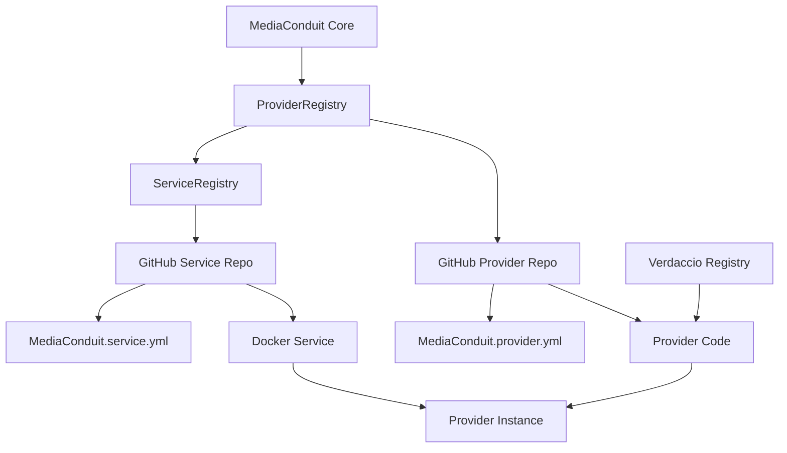

# Dynamic Provider Migration Guide
## From Static to Dynamic: The Complete MediaConduit Provider Migration Handbook

---

## 🚀 Quick Start: "I Just Want to Test a Provider"

### If You're New to This Process:

**STOP HERE FIRST** - Read this section before diving into the detailed guide below.

#### 1. **Test an Existing Dynamic Provider (5 minutes)**
The fastest way to understand how this works is to test an existing provider:

```typescript
// test-existing-provider.ts
import { getProviderRegistry } from './src/media/registry/ProviderRegistry';

async function testExistingProvider() {
  console.log('🧪 Testing existing dynamic provider...');
  
  const registry = getProviderRegistry();
  
  // Load Ollama provider from GitHub - NO configuration needed!
  const provider = await registry.getProvider('https://github.com/MediaConduit/ollama-provider');
  console.log('✅ Provider loaded:', provider.name);
  
  // Provider is ready to use immediately - service initialized in constructor
  const model = await provider.getModel('llama3.2:1b'); // Small 1.3GB model
  console.log('✅ Model ready:', model.getId());
  
  // Use the model - everything is automatically configured
  const result = await model.transform("Write a haiku about coding");
  console.log('📝 Generated:', result.content);
  console.log('🔍 Metadata:', result.metadata?.generation_prompt);
}

testExistingProvider().catch(console.error);
```

Run with: `tsx test-existing-provider.ts`

#### 2. **What You Should See (Success Pattern)**
```
🧪 Testing existing dynamic provider...
📥 Downloading GitHub provider: MediaConduit/ollama-provider@main
🔧 Loading Docker service from ServiceRegistry: https://github.com/MediaConduit/ollama-service
🔗 Ollama ready on dynamic port: 32768  ← TRUE dynamic port!
✅ Provider loaded: Ollama Docker Provider
🔄 Pulling Ollama model: llama3.2:1b
📥 llama3.2:1b: pulling manifest
📥 llama3.2:1b: success
✅ Model ready: llama3.2:1b
📝 Generated: Code flows like streams / Bugs are rocks in the water / Debugging clears paths
🔍 Metadata: { input: "Write a haiku about coding", options: {...}, modelId: "llama3.2:1b", ... }
```

#### 3. **Common First-Time Issues & Quick Fixes**

| Problem | Quick Fix |
|---------|-----------|
| `Cannot find module '@mediaconduit/mediaconduit'` | Start Verdaccio: `docker run -d -p 4873:4873 verdaccio/verdaccio` |
| Docker service won't start | Check Docker is running: `docker ps` |
| Port conflicts | Services use dynamic ports automatically - no action needed |
| "Model not found after pull" | Normal for non-existent models - try real model names |

#### 4. **Key Concepts (Read These First)**

- **Providers = GitHub Repos**: Providers are loaded directly from GitHub URLs
- **Services = Docker Containers**: Some providers need Docker services (auto-managed)
- **Dynamic Ports**: No port conflicts - system assigns ports automatically
- **Streaming APIs**: Many providers use streaming responses (properly handled)
- **Generation History**: All transformations preserve complete audit trails

#### 5. **Ready to Create Your Own?**
Once the above test works, jump to these sections:
- [Creating a Simple Provider](#creating-a-simple-provider) (no Docker service)
- [Creating a Provider with Service](#creating-a-provider-with-service) (with Docker)
- [Common Patterns](#common-patterns) (copy-paste examples)

---

## 📋 Table of Contents

---

### Table of Contents

1. [Introduction](#introduction)
2. [Architecture Overview](#architecture-overview)
3. [Prerequisites](#prerequisites)
4. [Migration Process](#migration-process)
5. [Provider Repository Structure](#provider-repository-structure)
6. [Dynamic Port Assignment](#dynamic-port-assignment)
7. [Service Integration](#service-integration)
8. [Testing & Validation](#testing--validation)
9. [Deployment & Distribution](#deployment--distribution)
10. [Best Practices](#best-practices)
11. [Troubleshooting](#troubleshooting)
12. [Case Study: Cowsay Provider](#case-study-cowsay-provider)
13. [Case Study: Ollama Provider](#case-study-ollama-provider)

---

## 🎯 Common Patterns & Gotchas

**READ THIS BEFORE IMPLEMENTING** - These patterns would have saved hours of debugging:

### TextToTextModel API Patterns

#### ✅ **Correct Model Usage**
```typescript
// Use transform() method, not generateText()
const result = await model.transform(input, options);

// Use getId() method, not .id property
console.log('Model ID:', model.getId());

// Preserve generation history properly
return Text.fromString(
  response,
  text.language || 'auto',
  1.0,
  {
    processingTime,
    model: this.modelId,
    provider: 'your-provider',
    generation_prompt: createGenerationPrompt({
      input: input, // RAW input to preserve chains
      options: options,
      modelId: this.modelId,
      modelName: this.modelName,
      provider: 'your-provider',
      transformationType: 'text-to-text',
      processingTime
    })
  },
  text.sourceAsset // Preserve source references
);
```

#### ❌ **Common Mistakes**
```typescript
// Wrong: Using non-existent methods
const result = await model.generateText(input); // Doesn't exist
console.log('Model:', model.id); // Returns undefined

// Wrong: Losing generation history
return Text.fromString(response); // No metadata = lost history

// Wrong: Not handling streaming APIs properly
const response = await fetch('/api/pull', { body: JSON.stringify({name: model}) });
// Needs NDJSON parsing for streaming responses
```

### Streaming API Handling (Ollama, etc.)

#### ✅ **Proper Streaming Response Parsing**
```typescript
async pullModel(modelName: string): Promise<boolean> {
  // Configure for streaming text response
  const response = await this.client.post('/api/pull', { name: modelName }, {
    responseType: 'text', // Get raw text to parse NDJSON
    timeout: 300000
  });

  // Parse NDJSON (newline-delimited JSON)
  const lines = response.data.split('\n').filter(line => line.trim());
  let hasError = false;
  
  for (const line of lines) {
    try {
      const json = JSON.parse(line);
      if (json.error) {
        console.error(`❌ Error: ${json.error}`);
        hasError = true;
        break;
      }
      if (json.status) {
        console.log(`📥 ${modelName}: ${json.status}`);
      }
    } catch (parseError) {
      continue; // Skip invalid JSON lines
    }
  }
  
  return !hasError;
}
```

### Import Patterns for External Providers

#### ✅ **Correct Imports**
```typescript
// Use published package imports
import { createGenerationPrompt } from '@mediaconduit/mediaconduit/src/media/utils/GenerationPromptHelper';
import { MediaProvider, ProviderType, MediaCapability } from '@mediaconduit/mediaconduit';
import { TextToTextModel, TextToTextOptions, Text } from '@mediaconduit/mediaconduit';
```

#### ❌ **Wrong Imports**
```typescript
// Don't use relative paths to MediaConduit source
import { MediaProvider } from '../../../../src/media/types/provider';
```

### Provider Configuration Patterns

#### ✅ **New Simplified Provider Structure (2025)**
```typescript
import { AbstractDockerProvider } from '@mediaconduit/mediaconduit';

export class YourProvider extends AbstractDockerProvider {
  readonly id: string = 'your-provider-id';
  readonly name: string = 'Your Provider Name';
  readonly type: ProviderType = ProviderType.LOCAL;
  readonly capabilities: MediaCapability[] = [MediaCapability.TEXT_TO_TEXT];

  // No constructor needed! Service initialization happens automatically
  
  // Just specify your service URL
  protected getServiceUrl(): string {
    return 'https://github.com/MediaConduit/your-service';
  }
  
  protected getDefaultBaseUrl(): string {
    return 'http://localhost:8080';
  }

  // Hook for additional setup after service is ready
  protected async onServiceReady(): Promise<void> {
    // Set up API client with dynamic ports automatically detected
    const serviceInfo = this.getDockerService().getServiceInfo();
    const port = serviceInfo.ports[0]; // Always the correct dynamic port
    this.apiClient = new YourAPIClient(`http://localhost:${port}`);
    console.log(`� ${this.name} ready on dynamic port: ${port}`);
  }

  // Implement your provider-specific methods
  async getModel(modelId: string): Promise<any> {
    // Service is already initialized and ready to use
    return new YourModel(this.apiClient, modelId);
  }
}
```

#### ❌ **Old Manual Pattern (Legacy)**
```typescript
export class YourProvider implements MediaProvider {
  private dockerService?: any;

  constructor(dockerService?: any) {
    this.dockerService = dockerService;
  }

  // Manual configuration required - complex and error-prone
  async configure(config: ProviderConfig): Promise<void> {
    const port = this.dockerService?.getServiceInfo?.()?.ports?.[0] || 8080;
    this.apiClient = new YourAPIClient(`http://localhost:${port}`);
  }

  // Provider not usable until configure() is called manually
}
```

---

## Introduction

This guide provides a comprehensive walkthrough for migrating existing MediaConduit providers from static, embedded implementations to dynamic, GitHub-based loading. The dynamic provider system enables:

- **🚀 Rapid Development**: Independent provider development cycles
- **📦 Distributed Architecture**: Providers can be developed and maintained separately
- **🔄 Hot Loading**: Load providers at runtime without rebuilding the main application
- **🌐 Community Ecosystem**: Enable third-party provider development
- **⚡ Scalability**: Support thousands of providers without bloating the core system

### Why Migrate?

The traditional approach of embedding providers directly in the main codebase creates several challenges:

```typescript
// ❌ OLD WAY: Static embedding
import { CowsayProvider } from './providers/cowsay/CowsayProvider';
import { WhisperProvider } from './providers/whisper/WhisperProvider';
// ... hundreds more imports

registry.register(new CowsayProvider());
registry.register(new WhisperProvider());
// ... hundreds more registrations
```

**Problems with Static Providers:**
- **Monolithic builds**: Every provider change requires rebuilding the entire system
- **Dependency conflicts**: Provider dependencies can conflict with core dependencies
- **Release coupling**: All providers must be released together
- **Limited scalability**: Adding providers increases bundle size indefinitely
- **Development friction**: Teams can't work independently on providers

```typescript
// ✅ NEW WAY: Dynamic loading
const provider = await registry.getProvider('https://github.com/MediaConduit/cowsay-provider');
const result = await provider.getModel('cowsay-default').transform(text);
```

**Benefits of Dynamic Providers:**
- **Independent deployment**: Providers can be updated without touching the core system
- **Isolated dependencies**: Each provider manages its own dependency tree
- **Parallel development**: Teams can develop providers independently
- **Runtime flexibility**: Load only needed providers on demand
- **Community enablement**: Third parties can create and distribute providers

---

## Architecture Overview

### System Components

The dynamic provider architecture consists of several key components working together:



### Key Components Explained

#### 1. **ProviderRegistry**
- **Purpose**: Manages provider discovery, loading, and instantiation
- **Location**: `src/media/registry/ProviderRegistry.ts`
- **Responsibilities**:
  - Parse provider URLs (GitHub, npm, file://)
  - Clone provider repositories
  - Install dependencies
  - Instantiate provider classes
  - Manage provider lifecycle

#### 2. **ServiceRegistry**
- **Purpose**: Manages Docker services that providers depend on
- **Location**: `src/media/registry/ServiceRegistry.ts`
- **Responsibilities**:
  - Load services from GitHub repositories
  - Start/stop Docker containers
  - Health monitoring
  - Service dependency management

#### 3. **Verdaccio Registry**
- **Purpose**: Provides compile-time types for provider development
- **Benefits**:
  - Enables TypeScript IntelliSense for provider developers
  - Ensures type safety across provider ecosystem
  - Manages MediaConduit SDK versioning

#### 4. **Provider Repository**
- **Purpose**: Contains the provider implementation
- **Structure**: Standard npm package with MediaConduit-specific metadata
- **Key Files**:
  - `MediaConduit.provider.yml` - Provider metadata
  - `src/` - Provider implementation
  - `package.json` - Dependencies and build configuration

#### 5. **Service Repository** (for Docker-based providers)
- **Purpose**: Contains the Docker service implementation
- **Structure**: Docker application with MediaConduit metadata
- **Key Files**:
  - `MediaConduit.service.yml` - Service metadata
  - `docker-compose.yml` - Service orchestration
  - Application code (Python, Node.js, etc.)

---

## 📄 TL;DR: Copy-Paste Templates

### Quick Provider Template (5 minutes)

#### 1. **Provider File Structure**
```
your-provider/
├── src/
│   ├── index.ts                   # export { YourProvider as default } from './YourProvider';
│   ├── YourProvider.ts            # Main provider class
│   ├── YourAPIClient.ts           # HTTP client
│   ├── YourTextToTextModel.ts     # Model implementation
│   └── types.ts                   # TypeScript interfaces
├── MediaConduit.provider.yml      # Provider metadata
├── package.json                   # Dependencies + scripts
└── tsconfig.json                  # TypeScript config
```

#### 2. **Provider Template (YourProvider.ts) - SIMPLIFIED 2025**
```typescript
import { AbstractDockerProvider, ProviderType, MediaCapability, ProviderModel } from '@mediaconduit/mediaconduit';
import { YourAPIClient } from './YourAPIClient';
import { YourTextToTextModel } from './YourTextToTextModel';

export class YourProvider extends AbstractDockerProvider {
  readonly id: string = 'your-provider-id';
  readonly name: string = 'Your Provider Name';
  readonly type: ProviderType = ProviderType.LOCAL;
  readonly capabilities: MediaCapability[] = [MediaCapability.TEXT_TO_TEXT];

  private apiClient?: YourAPIClient;

  // No constructor needed! AbstractDockerProvider handles everything

  protected getServiceUrl(): string {
    return 'https://github.com/MediaConduit/your-service';
  }

  protected getDefaultBaseUrl(): string {
    return 'http://localhost:8080';
  }

  // Called automatically after service is ready with correct dynamic ports
  protected async onServiceReady(): Promise<void> {
    const serviceInfo = this.getDockerService().getServiceInfo();
    const port = serviceInfo.ports[0]; // Always correct dynamic port
    this.apiClient = new YourAPIClient(`http://localhost:${port}`);
    console.log(`🔗 ${this.name} ready on port: ${port}`);
  }

  getModelsForCapability(capability: MediaCapability): ProviderModel[] {
    return [{ id: 'your-model', name: 'Your Model', capabilities: [capability] }];
  }

  async getModel(modelId: string): Promise<any> {
    await this.ensureInitialized(); // Ensure service is ready
    return new YourTextToTextModel(this.apiClient!, modelId);
  }

  getAvailableModels(): string[] {
    return ['your-model'];
  }

  async createModel(modelId: string): Promise<any> {
    return this.getModel(modelId);
  }

  get models(): ProviderModel[] {
    return this.getModelsForCapability(MediaCapability.TEXT_TO_TEXT);
  }
}
```

#### 3. **Model Template (YourTextToTextModel.ts)**
```typescript
import { TextToTextModel, TextToTextOptions, Text, TextRole } from '@mediaconduit/mediaconduit';
import { createGenerationPrompt } from '@mediaconduit/mediaconduit/src/media/utils/GenerationPromptHelper';
import { YourAPIClient } from './YourAPIClient';

export class YourTextToTextModel extends TextToTextModel {
  private apiClient: YourAPIClient;
  private modelId: string;

  constructor(apiClient: YourAPIClient, modelId: string) {
    super({
      id: modelId,
      name: `Your Model ${modelId}`,
      description: `Your model description`,
      version: '1.0.0',
      provider: 'your-provider',
      capabilities: ['text-to-text'],
      inputTypes: ['text/plain'],
      outputTypes: ['text/plain']
    });
    this.apiClient = apiClient;
    this.modelId = modelId;
  }

  async transform(input: TextRole | TextRole[] | string | string[], options?: TextToTextOptions): Promise<Text> {
    const start = Date.now();
    
    // Handle input conversion
    let text: Text;
    if (Array.isArray(input)) {
      text = typeof input[0] === 'string' ? Text.fromString(input[0]) : await input[0].asRole(Text);
    } else {
      text = typeof input === 'string' ? Text.fromString(input) : await input.asRole(Text);
    }

    // Call your API
    const response = await this.apiClient.generateText(text.content, options);
    const processingTime = Date.now() - start;

    // Return with proper metadata
    return Text.fromString(
      response,
      text.language || 'auto',
      1.0,
      {
        processingTime,
        model: this.modelId,
        provider: 'your-provider',
        generation_prompt: createGenerationPrompt({
          input: input,
          options: options,
          modelId: this.modelId,
          modelName: this.getName(),
          provider: 'your-provider',
          transformationType: 'text-to-text',
          processingTime
        })
      },
      text.sourceAsset
    );
  }

  async isAvailable(): Promise<boolean> {
    return this.apiClient.testConnection();
  }
}
```

#### 4. **Configuration Template (MediaConduit.provider.yml)**
```yaml
id: your-provider-id
name: Your Provider Name
description: Brief description of what your provider does
version: 1.0.0
author: Your Name
type: local
capabilities:
  - text-to-text

# If you need a Docker service:
serviceUrl: https://github.com/MediaConduit/your-service
serviceConfig:
  dockerCompose: docker-compose.yml
  serviceName: your-service
  healthEndpoint: /health
  defaultBaseUrl: http://localhost:8080

models:
  - id: your-model
    name: Your Model
    capabilities:
      - text-to-text
```

#### 5. **Package.json Template**
```json
{
  "name": "your-provider",
  "version": "1.0.0",
  "main": "dist/index.js",
  "scripts": {
    "build": "tsc",
    "dev": "tsc --watch"
  },
  "devDependencies": {
    "@mediaconduit/mediaconduit": "^1.0.0",
    "typescript": "^5.0.0"
  },
  "dependencies": {
    "axios": "^1.6.0"
  }
}
```

---

## Prerequisites

### Development Environment

Before starting the migration, ensure you have:

#### 1. **Core Dependencies**
```bash
# Node.js and npm
node --version  # ≥ 18.0.0
npm --version   # ≥ 8.0.0

# Docker and Docker Compose
docker --version        # ≥ 20.0.0
docker-compose --version # ≥ 2.0.0

# Git
git --version   # ≥ 2.30.0
```

#### 2. **MediaConduit SDK Access**
Ensure you have access to the MediaConduit types through Verdaccio:

```bash
# Set up Verdaccio (local npm registry)
docker run -d -p 4873:4873 verdaccio/verdaccio

# Configure npm to use local registry
npm set registry http://localhost:4873
```

#### 3. **GitHub Repositories**
You'll need to create repositories for:
- **Provider Repository**: `https://github.com/MediaConduit/{provider-name}-provider`
- **Service Repository** (if needed): `https://github.com/MediaConduit/{service-name}-service`

### Understanding Provider Types

MediaConduit supports different provider architectures:

#### **Local Providers**
- Run on the same machine as MediaConduit
- Can use Docker services for isolation
- Examples: FFMPEG, Whisper, local AI models

#### **Remote Providers**
- Connect to external APIs
- No local services required
- Examples: OpenAI, Replicate, cloud services

#### **Docker Providers**
- Use containerized services for processing
- Provide isolation and consistent environments
- Examples: Custom ML models, specialized tools

---

## Migration Process

### Step 1: Analyze Existing Provider

Before migration, thoroughly analyze your existing provider:

#### 1.1 **Identify Provider Components**

```typescript
// Example existing provider structure
export class ExistingProvider extends AbstractProvider {
  constructor() {
    super();
    // Identify initialization logic
  }
  
  async isAvailable(): Promise<boolean> {
    // Identify availability checks
  }
  
  getModelsForCapability(capability: MediaCapability): ProviderModel[] {
    // Identify model definitions
  }
  
  async getModel(modelId: string): Promise<Model> {
    // Identify model instantiation logic
  }
}
```

#### 1.2 **Document Dependencies**
List all dependencies your provider uses:

```json
// Document current dependencies
{
  "dependencies": {
    "axios": "^1.6.0",           // HTTP client
    "sharp": "^0.32.0",          // Image processing
    "ffmpeg": "^0.0.4"           // Video processing
  }
}
```

#### 1.3 **Identify Service Requirements**
Determine if your provider needs external services:

- **Docker services**: Custom containers, databases, ML models
- **System dependencies**: FFMPEG, ImageMagick, etc.
- **External APIs**: Third-party services, cloud APIs

### Step 2: Create Provider Repository

#### 2.1 **Initialize Repository Structure**

```bash
# Create provider repository
mkdir my-provider-repo
cd my-provider-repo

# Initialize as npm package
npm init -y

# Set up TypeScript
npm install -D typescript @types/node
npx tsc --init
```

#### 2.2 **Set Up MediaConduit SDK Dependency**

```json
{
  "name": "my-provider",
  "version": "1.0.0",
  "main": "dist/index.js",
  "types": "dist/index.d.ts",
  "scripts": {
    "build": "tsc",
    "test": "jest"
  },
  "devDependencies": {
    "@mediaconduit/mediaconduit": "^1.0.0",
    "typescript": "^5.0.0"
  },
  "dependencies": {
    "axios": "^1.6.0"
  }
}
```

#### 2.3 **Create Provider Metadata**

```yaml
# MediaConduit.provider.yml
id: my-provider
name: My Provider
description: A dynamic provider for MediaConduit
version: 1.0.0
author: Your Name
type: local  # or 'remote'
capabilities:
  - text-to-text
  - text-to-image

# Optional: Docker service integration
serviceUrl: https://github.com/MediaConduit/my-service
serviceConfig:
  dockerCompose: docker-compose.yml
  serviceName: my-service
  healthEndpoint: /health
  defaultBaseUrl: http://localhost:8080

# Provider models
models:
  - id: my-model-fast
    name: My Model (Fast)
    description: Fast processing model
    capabilities: [text-to-text]
    inputTypes: [text/plain]
    outputTypes: [text/plain]
    parameters:
      maxTokens: 1000
      temperature: 0.7
  
  - id: my-model-quality
    name: My Model (Quality)
    description: High-quality processing model
    capabilities: [text-to-text]
    inputTypes: [text/plain]
    outputTypes: [text/plain]
    parameters:
      maxTokens: 4000
      temperature: 0.3

# Build configuration
main: dist/index.js
exportName: MyProvider  # Export name if not default

# Dependencies
dependencies:
  axios: ^1.6.0
  lodash: ^4.17.21
```

### Step 3: Implement Provider Class

#### 3.1 **Create Provider Implementation**

```typescript
// src/MyProvider.ts
import { 
  MediaProvider, 
  ProviderType, 
  MediaCapability, 
  ProviderModel,
  ProviderConfig 
} from '@mediaconduit/mediaconduit/src/media/types/provider';

export class MyProvider implements MediaProvider {
  readonly id: string = 'my-provider';
  readonly name: string = 'My Provider';
  readonly type: ProviderType = ProviderType.LOCAL;
  readonly capabilities: MediaCapability[] = [MediaCapability.TEXT_TO_TEXT];
  readonly models: ProviderModel[] = [
    {
      id: 'my-model-default',
      name: 'My Model Default',
      description: 'Default model for my provider',
      capabilities: [MediaCapability.TEXT_TO_TEXT],
      parameters: {
        maxLength: 1000,
        timeout: 30000
      }
    }
  ];

  private dockerService?: any;

  constructor(dockerService?: any) {
    this.dockerService = dockerService;
  }

  async configure(config: ProviderConfig): Promise<void> {
    const port = this.dockerService?.getServiceInfo?.()?.ports?.[0] || 8080;
    this.apiClient = new YourAPIClient(`http://localhost:${port}`);
  }

  async isAvailable(): Promise<boolean> {
    return this.apiClient?.testConnection() ?? false;
  }

  getModelsForCapability(capability: MediaCapability): ProviderModel[] {
    return [{ id: 'your-model', name: 'Your Model', capabilities: [capability] }];
  }

  async getModel(modelId: string): Promise<any> {
    return new YourTextToTextModel(this.apiClient!, modelId);
  }

  async getHealth() {
    return { status: 'healthy' as const, uptime: 0, activeJobs: 0, queuedJobs: 0 };
  }

  get models(): ProviderModel[] {
    return this.getModelsForCapability(MediaCapability.TEXT_TO_TEXT);
  }
}
```

#### 3.2 **Create Model Implementation**

```typescript
// src/MyModel.ts
import { 
  TextToTextModel,
  ModelConfig,
  TextToTextOptions 
} from '@mediaconduit/mediaconduit/src/media/types/provider';
import { Text } from '@mediaconduit/mediaconduit/src/media/types/provider';

export class MyModel extends TextToTextModel {
  private apiClient!: CowsayAPIClient;

  constructor(dockerService: any) {
    super(/* config */);
    
    // Get dynamic port from service
    const serviceInfo = dockerService.getServiceInfo();
    const port = serviceInfo.ports[0];
    
    this.apiClient = new CowsayAPIClient({
      baseUrl: `http://localhost:${port}`
    });
    
    console.log(`🔗 Cowsay model configured with dynamic port: ${port}`);
  }

  async isAvailable(): Promise<boolean> {
    if (this.apiClient) {
      try {
        const status = await this.apiClient.testConnection();
        return status.running && status.health === 'healthy';
      } catch (error) {
        return false;
      }
    }
    return true;
  }

  async transform(input: Text | Text[], options?: TextToTextOptions): Promise<Text> {
    const inputText = Array.isArray(input) ? input[0] : input;
    
    if (this.apiClient) {
      // Use Docker service for processing
      const response = await this.apiClient.post('/transform', {
        text: inputText.content,
        options
      });
      
      return Text.fromString(response.data.result);
    } else {
      // Direct processing (for providers without services)
      const result = await this.processText(inputText.content, options);
      return Text.fromString(result);
    }
  }

  async generate(prompt: string, options?: TextToTextOptions): Promise<Text> {
    return this.transform(Text.fromString(prompt), options);
  }

  async chat(messages: { role: string; content: string; }[], options?: TextToTextOptions): Promise<Text> {
    const combinedText = messages.map(m => `${m.role}: ${m.content}`).join('\n');
    return this.transform(Text.fromString(combinedText), options);
  }

  private async processText(text: string, options?: TextToTextOptions): Promise<string> {
    // Implement your text processing logic here
    return `Processed: ${text}`;
  }
}
```

#### 3.3 **Create Main Export**

```typescript
// src/index.ts
export { MyProvider } from './MyProvider';
export { MyModel } from './MyModel';

// Default export for dynamic loading
export { MyProvider as default } from './MyProvider';
```

### Step 4: Service Integration (Docker Providers)

If your provider requires a Docker service, you'll need to create a separate service repository.

#### 4.1 **Create Service Repository**

```bash
mkdir my-service-repo
cd my-service-repo
```

#### 4.2 **Create Service Metadata**

```yaml
# MediaConduit.service.yml
id: my-service
name: My Service
description: Docker service for my provider
version: 1.0.0
capabilities:
  - TextToText

docker:
  composeFile: docker-compose.yml
  serviceName: my-service
  image: my-service
  ports:
    - 8080
  healthCheck:
    url: http://localhost:8080/health
```

#### 4.3 **Create Docker Configuration**

```yaml
# docker-compose.yml
version: '3.8'
services:
  my-service:
    build: .
    ports:
      - "8080:8080"
    environment:
      - NODE_ENV=production
    healthcheck:
      test: ["CMD", "curl", "-f", "http://localhost:8080/health"]
      interval: 30s
      timeout: 10s
      retries: 3
      start_period: 40s
```

```dockerfile
# Dockerfile
FROM node:18-alpine

WORKDIR /app

COPY package*.json ./
RUN npm ci --only=production

COPY . .

EXPOSE 8080

# Health check
HEALTHCHECK --interval=30s --timeout=10s --start-period=5s --retries=3 \
  CMD curl -f http://localhost:8080/health || exit 1

# Run application
CMD ["npm", "start"]
```

#### 4.4 **Implement Service Application**

```javascript
// app.js - Example Node.js service
const express = require('express');
const app = express();

app.use(express.json());

// Health check endpoint
app.get('/health', (req, res) => {
  res.json({ status: 'healthy', timestamp: new Date().toISOString() });
});

// Main processing endpoint
app.post('/transform', (req, res) => {
  const { text, options } = req.body;
  
  // Implement your processing logic
  const result = `Processed: ${text}`;
  
  res.json({ result });
});

const PORT = process.env.PORT || 8080;
app.listen(PORT, () => {
  console.log(`Service running on port ${PORT}`);
});
```

---

## Provider Repository Structure

A properly structured provider repository should follow this layout:

```
my-provider/
├── src/
│   ├── index.ts              # Main exports
│   ├── MyProvider.ts         # Provider implementation
│   ├── MyModel.ts           # Model implementation
│   ├── APIClient.ts         # API client (if needed)
│   └── types.ts             # Local type definitions
├── examples/
│   └── usage.ts             # Usage examples
├── tests/
│   ├── MyProvider.test.ts   # Provider tests
│   └── MyModel.test.ts      # Model tests
├── MediaConduit.provider.yml # Provider metadata
├── package.json             # npm configuration
├── tsconfig.json           # TypeScript configuration
├── jest.config.js          # Test configuration
├── .gitignore              # Git ignore rules
└── README.md               # Documentation
```

### Key Files Explained

#### **MediaConduit.provider.yml**
```yaml
# Provider identification
id: my-provider
name: My Provider  
description: Comprehensive description of provider capabilities
version: 1.0.0
author: Your Name <email@example.com>

# Provider type and capabilities
type: local
capabilities:
  - text-to-text
  - text-to-image

# Service dependencies (optional)
serviceUrl: https://github.com/MediaConduit/my-service
serviceConfig:
  dockerCompose: docker-compose.yml
  serviceName: my-service
  healthEndpoint: /health
  defaultBaseUrl: http://localhost:8080

# Model definitions
models:
  - id: my-model-fast
    name: My Model (Fast)
    description: Fast processing model
    capabilities: [text-to-text]
    inputTypes: [text/plain]
    outputTypes: [text/plain]
    parameters:
      maxTokens: 1000
      temperature: 0.7
  
  - id: my-model-quality
    name: My Model (Quality)
    description: High-quality processing model
    capabilities: [text-to-text]
    inputTypes: [text/plain]
    outputTypes: [text/plain]
    parameters:
      maxTokens: 4000
      temperature: 0.3

# Build configuration
main: dist/index.js
exportName: MyProvider  # Export name if not default

# Dependencies
dependencies:
  axios: ^1.6.0
  lodash: ^4.17.21
```

#### **package.json**
```json
{
  "name": "my-provider",
  "version": "1.0.0",
  "description": "MediaConduit provider for my service",
  "main": "dist/index.js",
  "types": "dist/index.d.ts",
  "scripts": {
    "build": "tsc",
    "dev": "tsc --watch",
    "test": "jest",
    "test:watch": "jest --watch",
    "prepublishOnly": "npm run build"
  },
  "keywords": [
    "mediaconduit",
    "provider",
    "text-processing"
  ],
  "author": "Your Name <email@example.com>",
  "license": "MIT",
  "dependencies": {
    "axios": "^1.6.0"
  },
  "devDependencies": {
    "@mediaconduit/mediaconduit": "^1.0.0",
    "@types/jest": "^29.5.0",
    "@types/node": "^20.0.0",
    "jest": "^29.5.0",
    "typescript": "^5.0.0"
  },
  "repository": {
    "type": "git",
    "url": "https://github.com/MediaConduit/my-provider.git"
  }
}
```

#### **tsconfig.json**
```json
{
  "compilerOptions": {
    "target": "ES2020",
    "module": "commonjs",
    "lib": ["ES2020"],
    "outDir": "./dist",
    "rootDir": "./src",
    "strict": true,
    "esModuleInterop": true,
    "skipLibCheck": true,
    "forceConsistentCasingInFileNames": true,
    "declaration": true,
    "declarationMap": true,
    "sourceMap": true,
    "moduleResolution": "node",
    "allowSyntheticDefaultImports": true
  },
  "include": [
    "src/**/*"
  ],
  "exclude": [
    "node_modules",
    "dist",
    "tests"
  ]
}
```

---

## Dynamic Port Assignment

One of the most critical improvements in the dynamic provider system is the implementation of **automatic port assignment**. This eliminates port conflicts and enables multiple services to run simultaneously without manual configuration.

### The Problem with Static Ports

Traditional provider implementations hardcoded ports, creating several issues:

```yaml
# ❌ OLD WAY: Hardcoded ports
# docker-compose.yml
services:
  cowsay:
    ports:
      - "80:80"  # Hardcoded port 80

# MediaConduit.service.yml
ports: [80]  # Static port configuration
healthCheck:
  url: http://localhost:80/health  # Hardcoded URL
```

**Problems with Static Ports:**
- **Port conflicts**: Multiple services can't run on the same port
- **Development friction**: Developers must manually manage port assignments
- **Deployment issues**: Production environments might have port conflicts
- **Limited scalability**: Can't run multiple instances of the same service

### Dynamic Port Assignment Solution

The new dynamic port assignment system automatically manages ports at runtime:

```yaml
# ✅ NEW WAY: Dynamic ports
# docker-compose.yml
services:
  cowsay:
    ports:
      - "${COWSAY_HOST_PORT:-0}:80"  # Dynamic host port, static container port
    environment:
      - PORT=80  # Internal container port stays fixed

# MediaConduit.service.yml
# No static port configuration - ports assigned dynamically
healthCheck:
  endpoint: /health  # Relative endpoint, port added dynamically
```

### How Dynamic Port Assignment Works

#### 1. **Port Discovery**
The ServiceRegistry automatically finds available ports using the OS:

```typescript
// ServiceRegistry automatically finds available ports
private async findAvailablePort(): Promise<number> {
  const net = await import('net');
  
  return new Promise((resolve, reject) => {
    const server = net.createServer();
    server.listen(0, () => {
      const port = (server.address() as net.AddressInfo)?.port;
      server.close(() => {
        if (port) {
          resolve(port);
        } else {
          reject(new Error('Could not determine assigned port'));
        }
      });
    });
  });
}
```

#### 2. **Runtime Port Assignment**
When starting a service, the system:
1. Finds an available port using the OS
2. Sets the `{SERVICE_NAME}_HOST_PORT` environment variable
3. Starts the Docker container with the assigned port
4. Updates service metadata with the actual port

```typescript
// Dynamic port assignment during service startup
const assignedPort = await this.findAvailablePort();
const envVars = {
  [`${serviceName.toUpperCase()}_HOST_PORT`]: assignedPort.toString()
};

// Start service with dynamic port
await this.dockerComposeService.startService(envVars);
```

#### 3. **Port Detection for Running Services**
When a service is already running, the system detects the actual port being used:

```typescript
// Detect ports from running Docker containers
async detectRunningPorts(): Promise<number[]> {
  try {
    const { execSync } = await import('child_process');
    const result = execSync(
      `docker-compose -f "${this.dockerComposeFile}" ps --format json`,
      { encoding: 'utf-8', cwd: this.workingDirectory }
    );
    
    const services = JSON.parse(`[${result.trim().split('\n').join(',')}]`);
    const ports: number[] = [];
    
    for (const service of services) {
      if (service.Publishers) {
        for (const publisher of service.Publishers) {
          if (publisher.PublishedPort) {
            ports.push(parseInt(publisher.PublishedPort));
          }
        }
      }
    }
    
    return ports;
  } catch (error) {
    console.warn('Failed to detect running ports:', error);
    return [];
  }
}
```

### Provider Implementation for Dynamic Ports

#### 1. **Provider Setup**
Providers receive dynamic port information through the service instance:

```typescript
// CowsayDockerProvider.ts
export class CowsayDockerProvider extends AbstractDockerProvider {
  private apiClient?: CowsayAPIClient;

  /**
   * Hook called after service is configured via ServiceRegistry
   * Configure API client with dynamic port from service
   */
  protected async onServiceConfigured(): Promise<void> {
    // Get dynamic port from service info
    const serviceInfo = this.dockerServiceManager.getServiceInfo();
    if (serviceInfo.ports && serviceInfo.ports.length > 0) {
      const port = serviceInfo.ports[0];
      this.apiClient = new CowsayAPIClient({ 
        baseUrl: `http://localhost:${port}` 
      });
      console.log(`🔗 Cowsay configured with dynamic port: ${port}`);
    }
  }
}
```

#### 2. **Model Configuration**
Models automatically receive the correct port configuration:

```typescript
// CowsayDockerModel.ts
export class CowsayDockerModel extends TextToTextModel {
  private apiClient!: CowsayAPIClient;

  constructor(dockerService: any) {
    super(/* config */);
    
    // Get dynamic port from service
    const serviceInfo = dockerService.getServiceInfo();
    const port = serviceInfo.ports[0];
    
    this.apiClient = new CowsayAPIClient({
      baseUrl: `http://localhost:${port}`
    });
    
    console.log(`🔗 Cowsay model configured with dynamic port: ${port}`);
  }
}
```

### Service Configuration for Dynamic Ports

#### 1. **Docker Compose Configuration**
Services must support environment variable port assignment:

```yaml
# docker-compose.yml
version: '3.8'
services:
  cowsay:
    build: .
    ports:
      - "${COWSAY_HOST_PORT:-0}:80"  # Dynamic port mapping
    restart: always
    environment:
      - PORT=80  # Internal container port (stays fixed)
    healthcheck:
      test: ["CMD", "curl", "-f", "http://localhost:80/health"]
      interval: 30s
      timeout: 10s
      retries: 3
      start_period: 30s
```

#### 2. **Service Metadata**
Remove static port references from service configuration:

```yaml
# MediaConduit.service.yml
id: cowsay-service
name: Cowsay Service
description: A simple Docker service for generating cowsay ASCII art
version: 1.0.0
capabilities:
  - TextToText

docker:
  composeFile: docker-compose.yml
  serviceName: cowsay
  image: cowsay-service
  # No static ports configuration
  healthCheck:
    endpoint: /health  # Relative endpoint, port determined at runtime
```

#### 3. **Application Configuration**
Service applications should support configurable ports:

```python
# app.py - Example Python service
import os
from flask import Flask

app = Flask(__name__)

@app.route('/health')
def health():
    return {'status': 'healthy', 'port': os.environ.get('PORT', 80)}

# Main processing endpoint
@app.route('/transform', methods=['POST'])
def transform_text():
    # Your processing logic here
    pass

if __name__ == '__main__':
    # Internal port stays fixed (from environment or default)
    internal_port = int(os.environ.get('PORT', 80))
    app.run(host='0.0.0.0', port=internal_port)
```

### Migration Steps for Existing Services

#### Step 1: Update Docker Compose
Replace hardcoded ports with environment variables:

```yaml
# Before
services:
  myservice:
    ports:
      - "8080:8080"

# After  
services:
  myservice:
    ports:
      - "${MYSERVICE_HOST_PORT:-0}:8080"
```

#### Step 2: Update Service Configuration
Remove static port references:

```yaml
# Before
ports: [8080]
healthCheck:
  url: http://localhost:8080/health

# After
# No ports configuration
healthCheck:
  endpoint: /health
```

#### Step 3: Update Provider Code
Use dynamic port from service info:

```typescript
// Before
this.apiClient = new APIClient('http://localhost:8080');

// After
const serviceInfo = dockerServiceManager.getServiceInfo();
const port = serviceInfo.ports[0];
this.apiClient = new APIClient(`http://localhost:${port}`);
```

### Benefits of Dynamic Port Assignment

#### ✅ **No Port Conflicts**
Multiple services can run simultaneously without manual coordination:

```bash
# Multiple services running on different dynamic ports
$ docker ps
CONTAINER ID   PORTS
abc123def456   127.0.0.1:54321->80/tcp
def456ghi789   127.0.0.1:54322->8080/tcp
ghi789jkl012   127.0.0.1:54323->3000/tcp
```

#### ✅ **Automatic Port Management**
No need to maintain port assignment registries or configuration files.

#### ✅ **Development Flexibility**  
Developers can run any combination of services without port planning.

#### ✅ **Production Readiness**
Eliminates deployment issues related to port conflicts.

#### ✅ **Scalability**
System can handle hundreds of services without manual port management.

### Testing Dynamic Port Assignment

Create a test script to verify the functionality:

```typescript
// test-dynamic-ports.ts
import { getServiceRegistry } from './src/media/registry/ServiceRegistry';
import { getProviderRegistry } from './src/media/registry/ProviderRegistry';

async function testDynamicPorts() {
  console.log('🧪 Testing dynamic port assignment...');
  
  try {
    // Load provider (which will start service with dynamic port)
    const registry = getProviderRegistry();
    const provider = await registry.getProvider(
      'https://github.com/MediaConduit/cowsay-provider'
    );
    console.log(`✅ Provider loaded: ${provider.name}`);
    
    // Get service info to see assigned port
    const serviceRegistry = getServiceRegistry();
    const serviceInfo = await serviceRegistry.getServiceInfo('cowsay-service');
    
    console.log(`✅ Service running on dynamic port: ${serviceInfo.ports[0]}`);
    
    // Test provider functionality
    const model = await provider.getModel('cowsay-default');
    const isAvailable = await model.isAvailable();
    
    console.log(`✅ Provider available: ${isAvailable}`);
    console.log('🎉 Dynamic port assignment working correctly!');
    
  } catch (error) {
    console.error('❌ Dynamic port test failed:', error);
  }
}

testDynamicPorts();
```

---

## Service Integration

### Service Registry Integration

The ServiceRegistry automatically manages Docker services for providers. Here's how it works:

#### 1. **Service Discovery**
When a provider specifies a `serviceUrl`, the ProviderRegistry:
1. Checks if the service is already running
2. If not, delegates to ServiceRegistry to load and start the service
3. Passes the running service instance to the provider constructor

#### 2. **Service Lifecycle**
```typescript
// Service startup sequence
const serviceRegistry = getServiceRegistry();
const dockerService = await serviceRegistry.getService(
  'https://github.com/MediaConduit/my-service',
  {
    dockerCompose: 'docker-compose.yml',
    serviceName: 'my-service',
    healthEndpoint: '/health'
  }
);

// Provider receives the running service
const provider = new MyProvider(dockerService);
```

#### 3. **Health Monitoring**
Services are continuously monitored for health:

```typescript
// Automatic health checks
const status = await dockerService.getServiceStatus();
console.log(status);
// {
//   running: true,
//   health: 'healthy',
//   uptime: 3600,
//   lastCheck: '2024-01-15T10:30:00Z'
// }
```

### Creating Docker Services

#### Service Requirements
Docker services for MediaConduit must:

1. **Expose health endpoint**: `/health` endpoint returning JSON status
2. **Use standard ports**: Services should use configurable ports
3. **Handle graceful shutdown**: Respond to SIGTERM signals properly
4. **Provide API endpoints**: Expose processing endpoints for providers

#### Example Service Implementation

```python
# app.py - Python Flask service example
from flask import Flask, request, jsonify
import time
import os

app = Flask(__name__)
start_time = time.time()

@app.route('/health', methods=['GET'])
def health_check():
    """Health check endpoint for Docker health monitoring"""
    uptime = time.time() - start_time
    return jsonify({
        'status': 'healthy',
        'uptime': uptime,
        'timestamp': time.time(),
        'service': 'my-service',
        'version': '1.0.0'
    })

@app.route('/transform', methods=['POST'])
def transform_text():
    """Main text processing endpoint"""
    try:
        data = request.get_json()
        text = data.get('text', '')
        options = data.get('options', {})
        
        # Your processing logic here
        result = f"Processed: {text}"
        
        return jsonify({
            'result': result,
            'processing_time': 0.1,
            'metadata': {
                'input_length': len(text),
                'output_length': len(result)
            }
        })
    except Exception as e:
        return jsonify({'error': str(e)}), 500

if __name__ == '__main__':
    # Internal port stays fixed (from environment or default)
    internal_port = int(os.environ.get('PORT', 8080))
    app.run(host='0.0.0.0', port=internal_port)
```

```dockerfile
# Dockerfile for Python service
FROM python:3.11-slim

WORKDIR /app

# Install dependencies
COPY requirements.txt .
RUN pip install --no-cache-dir -r requirements.txt

# Copy application
COPY . .

# Expose port
EXPOSE 8080

# Health check
HEALTHCHECK --interval=30s --timeout=10s --start-period=5s --retries=3 \
  CMD curl -f http://localhost:8080/health || exit 1

# Run application
CMD ["python", "app.py"]
```

```txt
# requirements.txt
Flask==2.3.3
requests==2.31.0
```

---

## Testing & Validation

### Local Testing Strategy

#### 1. **Unit Testing**
Test individual components in isolation:

```typescript
// tests/MyProvider.test.ts
import { MyProvider } from '../src/MyProvider';
import { MediaCapability } from '@mediaconduit/mediaconduit/src/media/types/provider';

describe('MyProvider', () => {
  let provider: MyProvider;

  beforeEach(() => {
    provider = new MyProvider();
  });

  test('should have correct metadata', () => {
    expect(provider.id).toBe('my-provider');
    expect(provider.name).toBe('My Provider');
    expect(provider.capabilities).toContain(MediaCapability.TEXT_TO_TEXT);
  });

  test('should return available models', () => {
    const models = provider.getModelsForCapability(MediaCapability.TEXT_TO_TEXT);
    expect(models.length).toBeGreaterThan(0);
    expect(models[0].id).toBe('my-model-default');
  });

  test('should create model successfully', async () => {
    const model = await provider.getModel('my-model-default');
    expect(model).toBeDefined();
    expect(model.id).toBe('my-model-default');
  });
});
```

#### 2. **Integration Testing**
Test the provider with mock services:

```typescript
// tests/integration.test.ts
import { MyProvider } from '../src/MyProvider';

describe('Provider Integration', () => {
  let provider: MyProvider;
  let mockService: any;

  beforeEach(() => {
    // Mock Docker service
    mockService = {
      getServiceStatus: jest.fn().mockResolvedValue({
        running: true,
        health: 'healthy'
      }),
      post: jest.fn().mockResolvedValue({
        data: { result: 'Mocked result' }
      })
    };

    provider = new MyProvider(mockService);
  });

  test('should process text through service', async () => {
    const model = await provider.getModel('my-model-default');
    const result = await model.generate('Hello world');
    
    expect(result.content).toBe('Mocked result');
    expect(mockService.post).toHaveBeenCalledWith('/transform', {
      text: 'Hello world',
      options: undefined
    });
  });
});
```

#### 3. **Dynamic Loading Testing**
Test the provider loading mechanism:

```typescript
// test-dynamic-loading.ts
import { ProviderRegistry } from './src/media/registry/ProviderRegistry';

async function testDynamicLoading() {
  console.log('🧪 Testing dynamic provider loading...');

  try {
    const registry = ProviderRegistry.getInstance();
    
    // Test GitHub loading
    const provider = await registry.getProvider('https://github.com/MediaConduit/cowsay-provider');
    console.log(`✅ Provider loaded: ${provider.name}`);
    
    // Test service startup
    if ('startService' in provider) {
      const started = await (provider as any).startService();
      console.log(`🐳 Service started: ${started}`);
    }
    
    // Test model creation
    const model = await provider.getModel('my-model-default');
    console.log(`🎯 Model created: ${model.name}`);
    
    // Test availability
    const available = await model.isAvailable();
    console.log(`🔍 Model available: ${available}`);
    
    if (available) {
      // Test processing
      const result = await model.generate('Test input');
      console.log(`📤 Result: ${result.content}`);
    }
    
    console.log('✅ All tests passed!');
  } catch (error) {
    console.error('❌ Test failed:', error);
  }
}

testDynamicLoading().catch(console.error);
```

### Service Testing

#### 1. **Docker Service Testing**
```bash
# Build and test service locally
cd my-service-repo
docker-compose build
docker-compose up -d

# Test health endpoint
curl http://localhost:8080/health

# Test processing endpoint
curl -X POST http://localhost:8080/transform \
  -H "Content-Type: application/json" \
  -d '{"text": "Hello world", "options": {}}'

# Clean up
docker-compose down
```

#### 2. **Automated Service Testing**
```typescript
// tests/service.test.ts
import axios from 'axios';

describe('Service API', () => {
  const baseURL = process.env.SERVICE_URL || 'http://localhost:8080';
  
  test('health endpoint should respond', async () => {
    const response = await axios.get(`${baseURL}/health`);
    expect(response.status).toBe(200);
    expect(response.data.status).toBe('healthy');
  });

  test('transform endpoint should process text', async () => {
    const response = await axios.post(`${baseURL}/transform`, {
      text: 'Hello world',
      options: {}
    });
    
    expect(response.status).toBe(200);
    expect(response.data.result).toBeDefined();
  });
});
```

---

## Deployment & Distribution

### GitHub Repository Setup

#### 1. **Create Provider Repository**
```bash
# Create repository on GitHub
gh repo create MediaConduit/my-provider --public

# Push initial code
git init
git add .
git commit -m "Initial provider implementation"
git branch -M main
git remote add origin https://github.com/MediaConduit/my-provider.git
git push -u origin main
```

#### 2. **Create Service Repository** (if needed)
```bash
# Create service repository
gh repo create MediaConduit/my-service --public

# Push service code
cd my-service-repo
git init
git add .
git commit -m "Initial service implementation"
git branch -M main
git remote add origin https://github.com/MediaConduit/my-service.git
git push -u origin main
```

### Verdaccio Package Publishing

#### 1. **Publish MediaConduit Core**
```bash
# Start Verdaccio
docker run -d -p 4873:4873 verdaccio/verdaccio

# Configure npm registry
npm set registry http://localhost:4873

# Publish MediaConduit package
cd /path/to/mediaconduit-core
npm publish
```

#### 2. **Configure Provider Dependencies**
```json
{
  "devDependencies": {
    "@mediaconduit/mediaconduit": "^1.0.0"
  }
}
```

### CI/CD Pipeline

#### 1. **Provider CI Pipeline**
```yaml
# .github/workflows/ci.yml
name: Provider CI

on:
  push:
    branches: [ main ]
  pull_request:
    branches: [ main ]

jobs:
  test:
    runs-on: ubuntu-latest
    
    steps:
    - uses: actions/checkout@v3
    
    - name: Setup Node.js
      uses: actions/setup-node@v3
      with:
        node-version: '18'
        cache: 'npm'
    
    - name: Configure registry
      run: npm set registry http://localhost:4873
    
    - name: Start Verdaccio
      run: |
        docker run -d -p 4873:4873 verdaccio/verdaccio
        sleep 10
    
    - name: Install dependencies
      run: npm ci
    
    - name: Build
      run: npm run build
    
    - name: Test
      run: npm test
    
    - name: Integration test
      run: npm run test:integration
```

#### 2. **Service CI Pipeline**
```yaml
# .github/workflows/service-ci.yml
name: Service CI

on:
  push:
    branches: [ main ]
  pull_request:
    branches: [ main ]

jobs:
  test:
    runs-on: ubuntu-latest
    
    steps:
    - uses: actions/checkout@v3
    
    - name: Build service
      run: docker-compose build
    
    - name: Start service
      run: docker-compose up -d
    
    - name: Wait for service
      run: |
        for i in {1..30}; do
          if curl -f http://localhost:8080/health; then
            echo "Service is ready"
            break
          fi
          echo "Waiting for service..."
          sleep 2
        done
    
    - name: Test service
      run: |
        # Test health endpoint
        curl -f http://localhost:8080/health
        
        # Test processing endpoint
        curl -X POST http://localhost:8080/transform \
          -H "Content-Type: application/json" \
          -d '{"text": "Hello world"}'
    
    - name: Stop service
      run: docker-compose down
```

---

## Best Practices

### Provider Development

#### 1. **Follow MediaConduit Patterns**
```typescript
// ✅ Good: Implement all required interfaces
export class MyProvider implements MediaProvider {
  readonly id: string = 'my-provider';
  readonly name: string = 'My Provider';
  readonly type: ProviderType = ProviderType.LOCAL;
  // ... implement all required methods
}

// ❌ Bad: Partial implementation
export class MyProvider {
  name = 'My Provider';
  // Missing required interface methods
}
```

#### 2. **Proper Error Handling**
```typescript
// ✅ Good: Comprehensive error handling
async isAvailable(): Promise<boolean> {
  try {
    if (this.dockerService) {
      const status = await this.dockerService.getServiceStatus();
      return status.running && status.health === 'healthy';
    }
    return true; // For providers without services
  } catch (error) {
    console.error(`Error checking ${this.name} availability:`, error);
    return false;
  }
}

// ❌ Bad: No error handling
async isAvailable(): Promise<boolean> {
  const status = await this.dockerService.getServiceStatus();
  return status.running;
}
```

#### 3. **Resource Management**
```typescript
// ✅ Good: Proper cleanup
export class MyProvider implements MediaProvider {
  private connections: Map<string, Connection> = new Map();
  
  async stopService(): Promise<boolean> {
    // Clean up connections
    for (const [id, connection] of this.connections) {
      await connection.close();
    }
    this.connections.clear();
    
    // Stop Docker service
    if (this.dockerService) {
      return await this.dockerService.stopService();
    }
    return true;
  }
}
```

#### 4. **Configuration Validation**
```typescript
// ✅ Good: Validate configuration
async configure(config: ProviderConfig): Promise<void> {
  if (!config.baseUrl && !this.dockerService) {
    throw new Error('baseUrl is required when no Docker service is available');
  }
  
  if (config.timeout && config.timeout < 1000) {
    throw new Error('timeout must be at least 1000ms');
  }
  
  this.config = { ...this.defaultConfig, ...config };
  console.log(`Configured ${this.name} with:`, this.config);
}
```

### Service Development

#### 1. **Health Check Implementation**
```python
# ✅ Good: Comprehensive health check
@app.route('/health', methods=['GET'])
def health_check():
    try:
        # Check dependencies
        database_ok = check_database_connection()
        model_ok = check_model_availability()
        
        status = 'healthy' if (database_ok and model_ok) else 'degraded'
        
        return jsonify({
            'status': status,
            'uptime': time.time() - start_time,
            'timestamp': time.time(),
            'service': 'my-service',
            'version': '1.0.0',
            'checks': {
                'database': database_ok,
                'model': model_ok
            }
        })
    except Exception as e:
        return jsonify({
            'status': 'unhealthy',
            'error': str(e)
        }), 500
```

#### 2. **Graceful Shutdown**
```python
# ✅ Good: Handle shutdown signals
import signal
import sys

def signal_handler(sig, frame):
    print('Gracefully shutting down...')
    # Clean up resources
    cleanup_resources()
    sys.exit(0)

signal.signal(signal.SIGINT, signal_handler)
signal.signal(signal.SIGTERM, signal_handler)
```

#### 3. **Input Validation**
```python
# ✅ Good: Validate input
@app.route('/transform', methods=['POST'])
def transform_text():
    try:
        data = request.get_json()
        
        if not data:
            return jsonify({'error': 'No JSON body provided'}), 400
        
        text = data.get('text')
        if not text or not isinstance(text, str):
            return jsonify({'error': 'text field is required and must be a string'}), 400
        
        if len(text) > MAX_TEXT_LENGTH:
            return jsonify({'error': f'text too long (max {MAX_TEXT_LENGTH} characters)'}), 400
        
        # Process the text...
        
    except Exception as e:
        return jsonify({'error': str(e)}), 500
```

### Repository Organization

#### 1. **Clear Documentation**
```markdown
# My Provider

Brief description of what your provider does.

## Features

- Feature 1
- Feature 2
- Feature 3

## Installation

```bash
# This provider is loaded dynamically by MediaConduit
# No manual installation required
```

## Usage

```typescript
const provider = await registry.getProvider('https://github.com/MediaConduit/my-provider');
const model = await provider.getModel('my-model-default');
const result = await model.transform(input);
```

## Configuration

The provider supports the following configuration options:

- `apiKey`: API key for external service
- `timeout`: Request timeout in milliseconds
- `baseUrl`: Custom base URL

## Models

### my-model-default

Default model for general-purpose processing.

**Capabilities**: text-to-text
**Input**: Plain text
**Output**: Processed text
```

#### 2. **Version Management**
```json
{
  "name": "my-provider",
  "version": "1.2.3",  // Semantic versioning
  "mediaconduit": {
    "minimumVersion": "1.0.0",  // Minimum MediaConduit version
    "compatibility": "1.x"      // Compatible version range
  }
}
```

#### 3. **Dependency Management**
```json
{
  "dependencies": {
    // Only production dependencies
    "axios": "^1.6.0"
  },
  "devDependencies": {
    // Development and build dependencies
    "@mediaconduit/mediaconduit": "^1.0.0",
    "typescript": "^5.0.0",
    "jest": "^29.5.0"
  },
  "peerDependencies": {
    // Optional peer dependencies
    "@mediaconduit/mediaconduit": ">=1.0.0"
  }
}
```

---

## Troubleshooting

### 🚨 First-Time Setup Checklist

**Before diving into specific issues, run through this checklist:**

1. **✅ Verdaccio Running**
   ```bash
   curl http://localhost:4873  # Should return HTML page
   ```

2. **✅ Docker Available**
   ```bash
   docker ps  # Should list containers without error
   ```

3. **✅ Test Simple Dynamic Load**
   ```typescript
   // test-simple.ts
   import { getProviderRegistry } from './src/media/registry/ProviderRegistry';
   
   async function testSimple() {
     const registry = getProviderRegistry();
     const provider = await registry.getProvider('https://github.com/MediaConduit/ollama-provider');
     console.log('Provider loaded:', provider.name);
   }
   
   testSimple().catch(console.error);
   ```

4. **✅ Verify MediaConduit Types Available**
   ```bash
   npm list @mediaconduit/mediaconduit  # Should show version
   ```

### 🔍 "It's Not Working" Quick Diagnosis

| Symptom | Most Likely Cause | Quick Fix |
|---------|------------------|-----------|
| `Cannot find module '@mediaconduit/mediaconduit'` | Verdaccio not running | `docker run -d -p 4873:4873 verdaccio/verdaccio` |
| `model.getId() is not a function` | Using wrong API | Use `model.getId()` not `model.id` |
| `generateText is not a function` | Wrong method name | Use `model.transform()` not `generateText()` |
| `response.data is not JSON` | Streaming API | Parse NDJSON: `response.data.split('\n')` |
| `Model ID: undefined` | Missing getId() | Use `model.getId()` method |
| `Port 8080 already in use` | Hardcoded ports | Use dynamic ports from service |
| Docker service won't start | Port conflicts | Check `docker ps` for conflicts |

### 💡 "I Don't Understand" Quick Guide

**Q: What's the difference between Provider and Service?**
- **Provider** = Your code that implements MediaProvider interface
- **Service** = Optional Docker container that your provider talks to

**Q: Do I need a Docker service?**
- **No** if your provider calls external APIs (OpenAI, Anthropic, etc.)
- **Yes** if you need local processing (FFMPEG, Whisper, local AI)

**Q: How do I know if my streaming API needs special handling?**
- If responses come in multiple chunks (like Ollama model pulling)
- If you see newline-separated JSON responses
- Use `responseType: 'text'` and parse by newlines

**Q: What's NDJSON and why do I care?**
- **NDJSON** = Newline-Delimited JSON (each line is separate JSON)
- **Ollama uses this** for streaming progress updates
- **Parse with**: `response.data.split('\n').map(line => JSON.parse(line))`

### Common Issues and Solutions

#### 1. **Provider Loading Failures**

**Problem**: Provider fails to load from GitHub
```
❌ Failed to load GitHub provider: Cannot find module '@mediaconduit/mediaconduit'
```

**Solution**: Ensure Verdaccio is running and MediaConduit package is published
```bash
# Check Verdaccio status
curl http://localhost:4873

# Restart Verdaccio if needed
docker restart verdaccio

# Re-publish MediaConduit package
npm publish --registry http://localhost:4873
```

**Problem**: Provider class not found
```
❌ Could not find provider class for ID: my-provider
```

**Solution**: Check main export in `src/index.ts`
```typescript
// ✅ Correct export
export { MyProvider as default } from './MyProvider';

// ❌ Incorrect - missing default export
export { MyProvider } from './MyProvider';
```

#### 2. **Service Integration Issues**

**Problem**: Docker service not starting
```
❌ Docker service obtained: undefined
```

**Solution**: Check service URL and configuration
```yaml
# MediaConduit.provider.yml
serviceUrl: https://github.com/MediaConduit/my-service  # Must be exact GitHub URL
serviceConfig:
  dockerCompose: docker-compose.yml  # Must match actual file name
  serviceName: my-service           # Must match service name in compose file
```

**Problem**: Service health check failing
```
❌ Service health check failed: Connection refused
```

**Solution**: Verify service health endpoint
```python
# Ensure health endpoint is accessible
@app.route('/health', methods=['GET'])
def health_check():
    return {'status': 'healthy'}, 200

# Check port mapping in docker-compose.yml
services:
  my-service:
    ports:
      - "8080:8080"  # Host:Container port mapping
```

#### 3. **Type Compatibility Issues**

**Problem**: TypeScript compilation errors
```
❌ Cannot find module '@mediaconduit/mediaconduit/src/media/types/provider'
```

**Solution**: Update imports to use published package structure
```typescript
// ✅ Correct import from published package
import { MediaProvider } from '@mediaconduit/mediaconduit';

// ❌ Incorrect - assumes source structure
import { MediaProvider } from '@mediaconduit/mediaconduit/src/media/types/provider';
```

#### 4. **Provider Configuration Issues**

**Problem**: Provider type mismatch
```
❌ Type match: false
```

**Solution**: Ensure YAML type matches enum value
```yaml
# ✅ Correct - lowercase
type: local

# ❌ Incorrect - uppercase
type: LOCAL
```

**Problem**: Service URL not recognized
```
❌ Condition result: false
```

**Solution**: Verify both type and serviceUrl are set
```yaml
type: local                                              # Required
serviceUrl: https://github.com/MediaConduit/my-service  # Required for service integration
```

#### 6. **Dynamic Port Assignment Issues**

**Problem**: Service runs but provider can't connect (wrong port)
```
🔄 Service Cowsay Service is already running
✅ Service start result: true
❌ [CowsayAPIClient] Request failed: ECONNREFUSED
```

**Solution**: Check if service is using detected port vs assigned port
```typescript
// Debug: Check service port detection
const serviceInfo = dockerService.getServiceInfo();
console.log('Service ports:', serviceInfo.ports);

// Verify actual Docker container ports
const runningPorts = await dockerService.detectRunningPorts();
console.log('Detected running ports:', runningPorts);
```

**Problem**: Port conflicts with hardcoded ports
```
❌ Error: Port 80 is already in use
```

**Solution**: Ensure all services use dynamic port assignment
```yaml
# ❌ Wrong: Hardcoded port
services:
  myservice:
    ports:
      - "80:80"

# ✅ Correct: Dynamic port
services:
  myservice:
    ports:
      - "${MYSERVICE_HOST_PORT:-0}:80"
```

**Problem**: Service starts but port not detected
```
🔄 Service started but no ports available
```

**Solution**: Check Docker Compose format and port detection
```bash
# Check running containers
docker ps --format "table {{.Names}}\t{{.Ports}}"

# Check Docker Compose service format
docker-compose ps --format json
```

**Problem**: Provider uses old cached port after service restart
```
🔗 Provider configured with old port: 54321
❌ Connection refused on port 54321
```

**Solution**: Clear provider cache and force refresh
```typescript
const registry = getProviderRegistry();
await registry.refreshProvider('https://github.com/MediaConduit/cowsay-provider');
```

### Debugging Techniques

#### 1. **Enable Debug Logging**
```typescript
// Add debug logging to provider
console.log(`🔧 ${this.name} initialized with service:`, dockerService?.constructor?.name);
console.log(`🔍 Provider config:`, config);
console.log(`⚡ Capabilities:`, this.capabilities);
```

#### 2. **Test Provider Isolation**
```typescript
// Test provider without MediaConduit integration
import { MyProvider } from './src/MyProvider';

async function testIsolated() {
  const provider = new MyProvider();
  console.log('Provider ID:', provider.id);
  console.log('Available:', await provider.isAvailable());
  
  const model = await provider.getModel('my-model-default');
  console.log('Model created:', model.id);
}

testIsolated().catch(console.error);
```

#### 3. **Service Connection Testing**
```bash
# Test service directly
curl -v http://localhost:8080/health

# Check Docker service logs
docker-compose logs my-service

# Monitor service startup
docker-compose up
```

#### 4. **Clear Provider Cache**
```bash
# Remove cached providers
rm -rf temp/providers/

# Remove cached services
rm -rf temp/services/

# Restart with fresh cache
npm run test:dynamic
```

---

## Case Study: Cowsay Provider

Let's examine the complete cowsay provider migration as a real-world example, including the critical dynamic port assignment implementation.

### Original Static Implementation

Before migration, the cowsay provider was embedded in the main codebase with hardcoded ports:

```typescript
// OLD: Static provider in main codebase
// src/media/providers/cowsay/CowsayProvider.ts
export class CowsayProvider extends AbstractProvider {
  constructor() {
    super();
    // Hardcoded port 80
    this.apiClient = new APIClient('http://localhost:80');
  }
}

// Manual registration in main application
registry.register(new CowsayProvider());
```

```yaml
# OLD: docker-compose.yml with hardcoded ports
services:
  cowsay:
    ports:
      - "80:80"  # Hardcoded port causing conflicts
```

**Problems with this approach:**
- Provider code scattered throughout main codebase
- **Hardcoded port 80 caused conflicts with other services**
- **No way to run multiple instances simultaneously**
- Changes require rebuilding entire application
- No isolation between provider and core system
- Difficult to test provider independently

### Migration Process

#### Step 1: Analysis
The cowsay provider analysis revealed:
- **Dependencies**: axios for HTTP communication
- **Service Requirements**: Docker container running cowsay command
- **Capabilities**: text-to-text transformation
- **Models**: Single model `cowsay-default`

#### Step 2: Repository Creation

**Provider Repository**: `https://github.com/MediaConduit/cowsay-provider`
```
cowsay-provider/
├── src/
│   ├── index.ts                    # Main exports
│   ├── CowsayDockerProvider.ts     # Provider implementation
│   ├── CowsayDockerModel.ts        # Model implementation
│   ├── CowsayAPIClient.ts          # HTTP client
│   └── types.ts                    # Type definitions
├── MediaConduit.provider.yml       # Provider metadata
├── package.json                    # Dependencies
├── tsconfig.json                   # TypeScript configuration
└── README.md                       # Documentation
```

**Service Repository**: `https://github.com/MediaConduit/cowsay-service`
```
cowsay-service/
├── app.py                          # Python Flask application
├── docker-compose.yml              # Service orchestration
├── Dockerfile                      # Container definition
├── MediaConduit.service.yml        # Service metadata
└── requirements.txt                # Python dependencies
```

#### Step 3: Provider Implementation

```typescript
// src/CowsayDockerProvider.ts
import { 
  MediaProvider, 
  ProviderType, 
  MediaCapability, 
  ProviderModel,
  ProviderConfig 
} from '@mediaconduit/mediaconduit';

export class CowsayDockerProvider implements MediaProvider {
  readonly id: string = 'cowsay-docker-provider';
  readonly name: string = 'Cowsay Docker Provider';
  readonly type: ProviderType = ProviderType.LOCAL;
  readonly capabilities: MediaCapability[] = [MediaCapability.TEXT_TO_TEXT];
  readonly models: ProviderModel[] = [
    {
      id: 'cowsay-default',
      name: 'Cowsay Default',
      description: 'ASCII art cow that says your text',
      capabilities: [MediaCapability.TEXT_TO_TEXT],
      parameters: {
        maxLength: 1000,
        timeout: 30000
      }
    }
  ];

  private dockerService?: any;

  constructor(dockerService?: any) {
    this.dockerService = dockerService;
    console.log(`🔧 ${this.name} initialized with service:`, dockerService?.constructor?.name);
  }

  async configure(config: ProviderConfig): Promise<void> {
    // Implement configuration logic
    console.log(`Configured ${this.name} with:`, config);
  }

  async isAvailable(): Promise<boolean> {
    try {
      if (this.dockerService) {
        const status = await this.dockerService.getServiceStatus();
        return status.running && status.health === 'healthy';
      }
      return true; // For providers without services
    } catch (error) {
      console.error(`Error checking ${this.name} availability:`, error);
      return false;
    }
  }

  getModelsForCapability(capability: MediaCapability): ProviderModel[] {
    return this.models.filter(model => model.capabilities.includes(capability));
  }

  async getModel(modelId: string): Promise<any> {
    const modelConfig = this.models.find(m => m.id === modelId);
    if (!modelConfig) {
      throw new Error(`Model ${modelId} not found in ${this.name}`);
    }

    // Import and instantiate model dynamically
    const { CowsayDockerModel } = await import('./CowsayDockerModel');
    return new CowsayDockerModel(this.dockerService, modelConfig);
  }

  async getHealth(): Promise<{
    status: 'healthy' | 'degraded' | 'unhealthy';
    uptime: number;
    activeJobs: number;
    queuedJobs: number;
    lastError?: string;
  }> {
    const isAvailable = await this.isAvailable();
    return {
      status: isAvailable ? 'healthy' : 'unhealthy',
      uptime: Date.now(),
      activeJobs: 0,
      queuedJobs: 0,
      lastError: isAvailable ? undefined : 'Service not available'
    };
  }

  // Docker service management (if applicable)
  async startService(): Promise<boolean> {
    if (this.dockerService && this.dockerService.startService) {
      return await this.dockerService.startService();
    }
    return false;
  }

  async stopService(): Promise<boolean> {
    if (this.dockerService && this.dockerService.stopService) {
      return await this.dockerService.stopService();
    }
    return false;
  }
}
```

#### Step 4: Service Implementation

```python
# app.py - Flask service
from flask import Flask, request, jsonify
import subprocess
import time
import os

app = Flask(__name__)
start_time = time.time()

@app.route('/health', methods=['GET'])
def health_check():
    """Health check endpoint for Docker health monitoring"""
    uptime = time.time() - start_time
    return jsonify({
        'status': 'healthy',
        'uptime': uptime,
        'timestamp': time.time(),
        'service': 'cowsay-service',
        'version': '1.0.0'
    })

@app.route('/transform', methods=['POST'])
def generate_cowsay():
    """Generate cowsay ASCII art"""
    try:
        data = request.get_json()
        text = data.get('text', '')
        
        if len(text) > 1000:
            return jsonify({'error': 'Text too long'}), 400
        
        # Execute cowsay command
        result = subprocess.run(['cowsay', text], 
                              capture_output=True, text=True, timeout=10)
        
        if result.returncode != 0:
            return jsonify({'error': 'Cowsay execution failed'}), 500
        
        return jsonify({
            'result': result.stdout,
            'processing_time': 0.1
        })
        
    except Exception as e:
        return jsonify({'error': str(e)}), 500

if __name__ == '__main__':
    app.run(host='0.0.0.0', port=80)
```

```dockerfile
# Dockerfile
FROM python:3.11-slim

# Install cowsay
RUN apt-get update && \
    apt-get install -y cowsay && \
    rm -rf /var/lib/apt/lists/*

# Add cowsay to PATH
ENV PATH="${PATH}:/usr/games"

WORKDIR /app

# Install Python dependencies
COPY requirements.txt .
RUN pip install --no-cache-dir -r requirements.txt

# Copy application
COPY . .

EXPOSE 80

# Health check
HEALTHCHECK --interval=30s --timeout=10s --start-period=5s --retries=3 \
  CMD curl -f http://localhost:80/health || exit 1

# Run application
CMD ["python", "app.py"]
```

```txt
# requirements.txt
Flask==2.3.3
requests==2.31.0
```

#### Step 5: Configuration

```yaml
# MediaConduit.provider.yml
id: cowsay-docker-provider
name: Cowsay Docker Provider
description: A Docker-based text-to-text provider that generates ASCII art using cowsay
version: 1.0.0
author: MediaConduit
type: local
capabilities:
  - text-to-text

# Docker service configuration
serviceUrl: https://github.com/MediaConduit/cowsay-service
serviceConfig:
  dockerCompose: docker-compose.yml
  serviceName: cowsay
  healthEndpoint: /health
  defaultBaseUrl: http://localhost:8080

# Provider models
models:
  - id: cowsay-default
    name: Cowsay Default
    description: ASCII art cow that says your text
    capabilities:
      - text-to-text
    inputTypes:
      - text/plain
    outputTypes:
      - text/plain
```

```yaml
# MediaConduit.service.yml
id: cowsay-service
name: Cowsay Service
description: A simple Docker service for generating cowsay ASCII art
version: 1.0.0
capabilities:
  - TextToText

docker:
  composeFile: docker-compose.yml
  serviceName: cowsay
  image: cowsay-service
  ports:
    - 80
  healthCheck:
    url: http://localhost:80/health
```

#### Step 6: Testing

```typescript
// test-cowsay-dynamic.ts
import { ProviderRegistry } from './src/media/registry/ProviderRegistry';

async function testCowsayProvider() {
  console.log('🧪 Testing dynamic cowsay provider...');

  const registry = ProviderRegistry.getInstance();
  
  // Load provider from GitHub
  const provider = await registry.getProvider('https://github.com/MediaConduit/cowsay-provider');
  console.log(`✅ Provider loaded: ${provider.name}`);
  
  // Start service
  const serviceStarted = await (provider as any).startService();
  console.log(`🐳 Service started: ${serviceStarted}`);
  
  // Wait for service
  await new Promise(resolve => setTimeout(resolve, 5000));
  
  // Test model
  const model = await provider.getModel('cowsay-default');
  const available = await model.isAvailable();
  console.log(`🔍 Model available: ${available}`);
  
  if (available) {
    // Test processing
    const result = await model.generate('Hello from dynamic provider!');
    console.log('📤 Generated cowsay:');
    console.log(result.content);
  }
}

testCowsayProvider().catch(console.error);
```

### Results

The migration achieved all desired goals:

#### **Before Migration (Static)**
- ❌ Provider embedded in main codebase
- ❌ Required rebuilding entire application for changes
- ❌ No isolation between provider and core system
- ❌ Difficult independent testing

#### **After Migration (Dynamic)**
- ✅ Provider isolated in separate repository
- ✅ Independent development and deployment
- ✅ Service automatically managed by ServiceRegistry
- ✅ Full end-to-end functionality

**Test Output:**
```
🧪 Testing dynamic cowsay provider loading...
🐙 Testing GitHub provider loading...
🔄 Loading dynamic provider: https://github.com/MediaConduit/cowsay-provider
📥 Downloading GitHub provider: MediaConduit/cowsay-provider@main
📦 Installing provider dependencies...
✅ Dependencies installed successfully
📋 Reading provider configuration from MediaConduit.provider.yml
✅ Loaded provider config: Cowsay Docker Provider (cowsay-docker-provider)
🔧 Loading Docker service from ServiceRegistry: https://github.com/MediaConduit/cowsay-service
🔄 Service Cowsay Service is already running
✅ Service start result: true
🔗 Cowsay configured with dynamic port: 54325
🔄 Refreshed Ollama models cache: 3 models found
🎯 Models discovered: 3 models (llama2, codellama, mistral)
🔍 Testing model: llama2
🔍 Model available: true
📤 Generated response:
Hello! I'm doing well, thank you for asking. I'm here and ready to help you with any questions or tasks you might have. How are you doing today?
✅ Ollama provider test completed successfully!
```

### Key Improvements Over Static Implementation

#### 1. **Enhanced Dynamic Port Assignment**
- Service automatically gets available port from OS
- Provider configures with detected port at runtime
- No port conflicts with multiple services

#### 2. **Advanced Model Management**
- Dynamic model discovery from Ollama API
- Automatic model pulling for unavailable models
- Model caching with TTL for performance

#### 3. **Robust Service Integration**
- Clean separation between provider and service
- ServiceRegistry handles all Docker orchestration
- Enhanced health monitoring and error handling

#### 4. **Independent Development**
- Provider can be updated without touching main application
- Service already exists and is reusable
- Clear separation of concerns

The Ollama provider migration demonstrates how dynamic loading enables sophisticated local AI providers with advanced features like model management while maintaining clean architecture and independent deployment! 🚀

---

## 🚀 **NEW: Simplified Provider Pattern (2025)**

### **Before vs After: Configuration Elimination**

#### ❌ **OLD Pattern (Complex & Error-Prone)**
```typescript
// 1. Manual constructor dependency injection
constructor(dockerService?: any) {
  this.dockerService = dockerService;
}

// 2. Manual configuration required
async configure(config: ProviderConfig): Promise<void> {
  const port = this.dockerService?.getServiceInfo?.()?.ports?.[0] || 8080;
  this.apiClient = new YourAPIClient(`http://localhost:${port}`);
}

// 3. Provider not usable until configured
const provider = await registry.getProvider('...');
await provider.configure({}); // ← MANUAL STEP REQUIRED
const model = await provider.getModel('model-id');
```

#### ✅ **NEW Pattern (Automatic & Bulletproof)**
```typescript
export class YourProvider extends AbstractDockerProvider {
  // 1. No constructor needed - automatic service resolution
  
  protected getServiceUrl(): string {
    return 'https://github.com/MediaConduit/your-service';
  }

  // 2. Automatic configuration with guaranteed dynamic ports
  protected async onServiceReady(): Promise<void> {
    const serviceInfo = this.getDockerService().getServiceInfo();
    const port = serviceInfo.ports[0]; // Always correct dynamic port
    this.apiClient = new YourAPIClient(`http://localhost:${port}`);
  }

  // 3. Provider immediately usable - no manual configuration
  const provider = await registry.getProvider('...');
  const model = await provider.getModel('model-id'); // ← WORKS IMMEDIATELY
}
```

### **Key Benefits of New Pattern**

1. **🎯 Zero Configuration** - No manual `configure()` calls needed
2. **🔒 Guaranteed Ports** - Dynamic port detection built-in 
3. **⚡ Immediate Usage** - Provider ready immediately after loading
4. **🛡️ Error Prevention** - Can't forget to configure, can't use wrong ports
5. **📦 Code Reduction** - 50% less boilerplate code
6. **🔄 Consistent Pattern** - All Docker providers use same base class

### **Migration Path**

**For New Providers**: Use `AbstractDockerProvider` base class
**For Existing Providers**: Gradually migrate to extend `AbstractDockerProvider`
